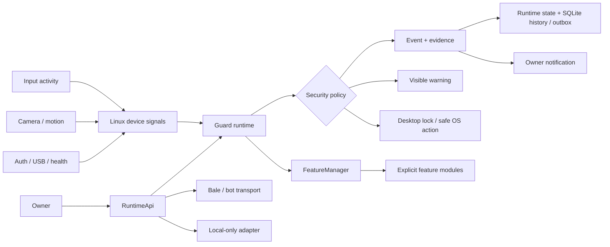

<div align="center">


# Laptop Guard

**Owner-controlled Linux laptop security, evidence, alerting, and safe response.**

[](CHANGELOG.md)
[](pyproject.toml)
[](docs/TESTING.md)
[](LICENSE)
[](docs/SECURITY.md)
[](docs/ARCHITECTURE.md)

[Quick start](#quick-start) · [Capabilities](#what-laptop-guard-can-do) · [Architecture](#how-it-works) · [Security](#security-and-privacy-boundaries) · [Documentation](#documentation) · [Roadmap](#roadmap)

</div>

---

## What is Laptop Guard?

Laptop Guard is a **Linux-first, owner-controlled security agent** for protecting a laptop when it is unattended or at risk of unauthorized use.

It combines local monitoring, bounded evidence capture, visible warning/lock response, owner notifications, event history, secure configuration, and a constrained remote-control surface. The project is designed around a simple rule: **the owner stays in control, and convenience must not silently weaken security or privacy boundaries**.

A typical intrusion flow is:

```text
unexpected activity
      ↓
classify + collect bounded evidence
      ↓
record event / notify owner
      ↓
show visible warning countdown
      ↓
lock the desktop when policy requires
      ↓
owner reviews status, evidence, and events
```

> [!IMPORTANT]
> Laptop Guard is intended for devices you own or are explicitly authorized to administer. It is not designed as covert surveillance software and deliberately avoids generic remote shell access, keylogging, hidden capture, or unrestricted remote command execution.

## Project status

| Item | Current state |
| --- | --- |
| Current release baseline | **11.1.0** |
| Runtime | Python **3.11+** |
| Primary platform | Linux / Ubuntu-oriented installation flow |
| Desktop sessions | X11 and Wayland, with backend/compositor-dependent capability differences |
| Service model | systemd user service + explicit autostart/arming controls |
| Owner transport | Bale / Telegram-style bot transport plus local-only runtime support |
| Development state | Active development; production-readiness hardening is tracked toward v12.0 |
| Repository navigation | Graphify-first for humans and AI agents |

See [CHANGELOG.md](CHANGELOG.md) for shipped changes and [docs/ROADMAP.md](docs/ROADMAP.md) for planned work.

## What Laptop Guard can do

| Capability | What it provides |
| --- | --- |
| **Guided setup** | Interactive configuration for identity, provider, owner pairing, camera/audio/security behavior, communication mode, local API, monitors, and startup. |
| **Readiness diagnostics** | `doctor` checks configuration, dependencies, capture backends, lock behavior, service readiness, and other security-critical prerequisites. |
| **Input activity monitoring** | Detects activity through Linux input backends without retaining typed key contents. |
| **Camera monitoring** | Camera discovery plus motion/person/tamper-oriented monitoring paths with capability-aware fallback behavior. |
| **Evidence capture** | Bounded camera and screen evidence designed to support an intrusion event without creating an unbounded capture system. |
| **Visible warning response** | Packaged five-second fullscreen warning media before lock/response actions where configured. |
| **Desktop protection** | Lock and selected system actions through fixed, explicit OS control paths rather than a generic command runner. |
| **Owner notifications** | Security events and selected evidence can be delivered through the configured owner transport. |
| **Owner control surface** | Status, arm/disarm, photo, screen, events, chat, voice/TTS, lock/unlock and confirmation-gated system actions. |
| **Protected stopping** | Local stop protection using a PIN plus owner confirmation paths, with fail-closed watchdog behavior when configured. |
| **Event history** | Shared SQLite-backed event history and durable outbound queue foundations. |
| **Secure state/config** | Non-secret configuration and protected secret storage under the user configuration directory; a project `.env` is not required. |
| **Audio + communication** | Voice recording/playback, TTS, intercom-style communication, and visible chat/notepad surfaces. |
| **RTL/LTR support** | Persian/RTL-aware chat rendering alongside LTR text. |
| **Service/autostart** | systemd user-service support with startup and automatic arming treated as separate decisions. |
| **Local control API** | Optional authenticated loopback-only fixed-action API; not a generic execution interface. |
| **Health / USB / auth signals** | System health, USB events, and readable Linux authentication failures can feed monitoring and notification paths. |

### What it deliberately does **not** provide

- no generic remote shell;
- no `eval` / `exec` command surface;
- no arbitrary remote filesystem controller;
- no password or credential collection;
- no keylogging of typed content;
- no intentionally hidden camera/microphone capture;
- no unbounded recording or retry loops by design;
- no assumption that unit tests alone prove real camera, microphone, Wayland, X11, systemd, or provider behavior.

These restrictions are part of the project architecture, not missing features. See [docs/SECURITY.md](docs/SECURITY.md) and [SECURITY.md](SECURITY.md).

## How it works



### Important architecture seams

Laptop Guard is evolving as a **modular monolith with ports/adapters**, not as a microservice system. The current architecture intentionally strengthens a few narrow seams instead of introducing parallel frameworks:

- `LaptopGuard` — top-level runtime orchestration;
- `RuntimeApi` — owner communication boundary;
- `FeatureManager` / `FeatureHost` — explicit command/feature extension system;
- `GuardRuntimeState` / `RuntimeStateStore` — shared live state;
- event + outbox storage — history and durable-delivery foundation;
- fixed OS/system action helpers — constrained privileged behavior;
- provider adapters — network transport implementation details.

For architecture work, start with [docs/ARCHITECTURE.md](docs/ARCHITECTURE.md), [docs/architecture/](docs/architecture/), and the [ADRs](docs/adr/).

## Quick start

### 1. Clone and enter the repository

```bash
git clone https://github.com/Mobin-Karam/laptop_guard_v3.git
cd laptop_guard_v3
```

### 2. Install

```bash
chmod +x install.sh run.sh doctor.sh
./install.sh
```

The installer creates a local virtual environment and installs the project dependencies.

### 3. Run guided setup

```bash
./run.sh setup
```

Setup walks through the configuration that actually applies to the selected capabilities. Missing required tokens, owner pairing, hardware selections, and related settings are handled through guided flows rather than requiring manual `.env` editing.

### 4. Check readiness

```bash
./run.sh doctor
```

### 5. Start Laptop Guard

```bash
./run.sh
```

> [!NOTE]
> Real hardware/session behavior varies by Linux distribution, desktop environment, X11/Wayland compositor, permissions, camera/microphone hardware, and provider availability. Use the target-device checks in [docs/TESTING.md](docs/TESTING.md).

## Common operations

```bash
./run.sh setup
./run.sh doctor
./run.sh status
./run.sh arm
./run.sh disarm
./run.sh profile away
./run.sh events --limit 20
./run.sh health
./run.sh service install
./run.sh service status
./run.sh autostart on
./run.sh autostart status
```

Hardware/integration checks:

```bash
./run.sh test camera
./run.sh test microphone
./run.sh test bot
./run.sh test lock
./run.sh test screen
./run.sh test input
```

## Owner controls

The exact available controls depend on configuration and transport, but the current runtime supports owner-facing actions such as:

| Area | Examples |
| --- | --- |
| Runtime | `/menu`, `/status`, `/arm`, `/disarm` |
| Evidence | `/photo`, `/screen` |
| Communication | `/listen`, `/chat`, `/say` |
| History | `/events` |
| Security | `/lock`, `/unlock`, `/stoppin` |
| System actions | confirmation-gated power actions when explicitly enabled |

Authorization is checked before privileged behavior. Sensitive actions are fixed and explicit; Laptop Guard does not turn bot messages into arbitrary shell commands.

## Configuration and local data

Laptop Guard keeps runtime configuration in the user configuration area rather than requiring a tracked project `.env`.

Typical data is under:

```text
~/.config/laptop-guard/
```

The configuration model separates normal settings from secrets. Secret material should never be committed, pasted into issues, added to tests, or printed in diagnostics.

For the canonical configuration and migration rules, read [docs/CONFIGURATION.md](docs/CONFIGURATION.md).

## Repository map

```text
laptop_guard_v3/
├── laptop_guard/              # product runtime
│   ├── features/              # explicit feature modules
│   ├── providers/             # provider adapters
│   └── assets/                # packaged warning/media assets
├── tests/                     # automated regression suite
├── docs/                      # architecture, security, testing and maintenance docs
│   ├── architecture/          # boundaries, flows, evolution plan
│   ├── adr/                   # architecture decisions
│   └── assets/                # README/documentation visuals
├── graphify-out/              # generated repository graph/navigation artifacts
├── .agents/skills/            # reusable project AI workflows
├── .codex/                    # project-local Codex agents + hooks
├── .github/
│   ├── workflows/             # CI / repository automation
│   ├── prompts/               # reusable engineering prompts
│   ├── instructions/          # path-scoped Copilot instructions
│   └── repository-management/ # declarative labels/milestones/issues/releases
├── install.sh                 # installer
├── run.sh                     # secure launcher
├── doctor.sh                  # readiness wrapper
└── pyproject.toml             # package metadata / dependencies
```

For the detailed ownership map, see [docs/FILE_REFERENCE.md](docs/FILE_REFERENCE.md).

## Graphify-first engineering

This repository uses **Graphify as the default discovery/navigation layer** for both humans and AI agents.

Before opening broad source ranges or recursively searching the tree:

```bash
graphify query "where is owner authorization enforced?"
graphify explain "LaptopGuard"
graphify path "InputMonitor" "EventStore"
```

Then inspect only the smallest authoritative files/tests/docs returned by the graph.

Current source and tests always win if generated graph data disagrees. See [docs/GRAPHIFY_NAVIGATION.md](docs/GRAPHIFY_NAVIGATION.md).

## Security and privacy boundaries

Laptop Guard is security-sensitive software. Important invariants include:

- owner authorization before privileged remote actions;
- explicit pairing and confirmation gates;
- loopback-only authenticated local control by default;
- bounded capture durations, payloads, queues, retries, and timeouts;
- no secret material in normal config/logs/issues/tests;
- visible/privacy-aware camera and microphone behavior;
- argument-list subprocess execution instead of variable shell composition;
- fail-closed behavior when authorization is ambiguous;
- explicit feature registration rather than filesystem plugin auto-execution.

If you discover a vulnerability, **do not open a normal public issue**. Follow [SECURITY.md](SECURITY.md).

## Testing and validation

Automated development setup:

```bash
python3 -m venv .venv
. .venv/bin/activate
python -m pip install --upgrade pip
python -m pip install -e ".[test]"
python -m pytest -q
```

Normal completion checks include:

```bash
.venv/bin/python -m pytest -q
.venv/bin/python -m compileall -q laptop_guard tests
bash -n install.sh run.sh doctor.sh repair-opencv.sh
.venv/bin/python -m pip check
git diff --check
```

CI currently validates the supported Python matrix. Hardware/session/provider behavior still requires target-device checks; automated tests do not prove physical camera, microphone, desktop-lock, compositor, systemd, or live provider behavior.

Read [docs/TESTING.md](docs/TESTING.md) before claiming a security-sensitive or hardware-dependent change is complete.

## Documentation

| Need | Start here |
| --- | --- |
| Documentation index | [docs/README.md](docs/README.md) |
| Repository navigation | [docs/GRAPHIFY_NAVIGATION.md](docs/GRAPHIFY_NAVIGATION.md) |
| Architecture contract | [docs/ARCHITECTURE.md](docs/ARCHITECTURE.md) |
| Current architecture evidence | [docs/SYSTEM_AUDIT.md](docs/SYSTEM_AUDIT.md) |
| Architecture evolution | [docs/architecture/](docs/architecture/) |
| Architecture decisions | [docs/adr/](docs/adr/) |
| Security model | [docs/SECURITY.md](docs/SECURITY.md) |
| Configuration | [docs/CONFIGURATION.md](docs/CONFIGURATION.md) |
| Testing | [docs/TESTING.md](docs/TESTING.md) |
| Feature lifecycle | [docs/FEATURE_LIFECYCLE.md](docs/FEATURE_LIFECYCLE.md) |
| Bug fixing | [docs/BUG_TRIAGE_AND_FIXING.md](docs/BUG_TRIAGE_AND_FIXING.md) |
| AI-agent workflow | [docs/AI_AGENT_WORKFLOW.md](docs/AI_AGENT_WORKFLOW.md) |
| Repository/README maintenance | [docs/README_MAINTENANCE.md](docs/README_MAINTENANCE.md) |
| Roadmap | [docs/ROADMAP.md](docs/ROADMAP.md) |
| History | [docs/HISTORY.md](docs/HISTORY.md) |

## AI-assisted development

Laptop Guard includes project-local agent tooling rather than relying on generic repository-wide prompts alone:

- `AGENTS.md` — authoritative repository policy;
- `.codex/agents/` — specialized navigator, architecture, implementation, review, security, testing, release, and repository-presentation roles;
- `.agents/skills/` — reusable Graphify, implementation, review, verification, release, issue-to-PR, and repository-presentation workflows;
- `.github/prompts/` — reusable task prompts for multiple assistants;
- `.codex/hooks/` — local guardrails and verification reminders.

The AI layer is designed to **reduce broad context loading, preserve project security rules, and make changes easier to verify**, not to replace source review or target-device testing.

## Roadmap

The repository currently separates shipped behavior from future milestones:

```text
11.1.x  current baseline / repository + architecture foundation
   ↓
11.2    setup & security hardening
   ↓
11.3    guided non-technical daily UX
   ↓
12.0    production-readiness release target
```

Architecture evolution proceeds in focused behavior-preserving slices alongside product work. See [docs/ROADMAP.md](docs/ROADMAP.md) and [docs/architecture/EVOLUTION_PLAN.md](docs/architecture/EVOLUTION_PLAN.md).

## Contributing

Start with [CONTRIBUTING.md](CONTRIBUTING.md). For non-trivial work:

1. use Graphify to locate the owning path and connected tests/docs;
2. follow the relevant feature/bug/architecture guide;
3. work on a focused branch;
4. add regression/failure tests;
5. run targeted checks, then the applicable full suite;
6. update user-facing documentation and repository presentation when behavior changes;
7. use security review for authentication, secrets, capture, network, process, OS-control, or remote-action changes.

## Repository presentation maintenance

The root README, GitHub About metadata, documentation index, package description, hero graphic, and release/version references are treated as maintained product surfaces.

Whenever a release, user-visible feature, command, supported platform, setup requirement, security boundary, or major architecture ownership changes, use:

```text
$repository-presentation
```

or the project `repository_curator` agent / `refresh-repository-presentation` prompt.

The canonical maintenance contract is [docs/README_MAINTENANCE.md](docs/README_MAINTENANCE.md), and CI tests prevent key presentation metadata from silently drifting from the package version and repository policy.

## License

Laptop Guard is licensed under the [MIT License](LICENSE).

---

<div align="center">

**Laptop security should be explicit, owner-controlled, recoverable, and understandable.**

[Back to top](#laptop-guard)

</div>
