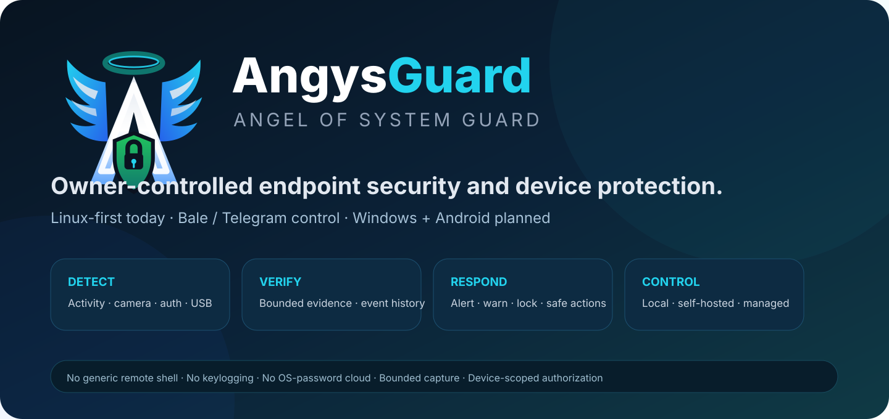
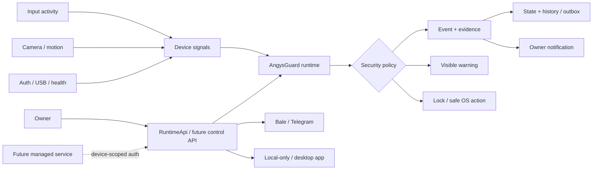

<div align="center">



# AngysGuard

**Angel of System Guard — owner-controlled device security, evidence, alerting, and safe response.**

> Current compatibility identifiers are still `laptop_guard_v3`, `laptop_guard`, and `laptop-guard`. The public AngysGuard naming migration is planned in issue #30 so existing installs are not broken by a sudden rename.

[](CHANGELOG.md)
[](pyproject.toml)
[](docs/PLATFORM_SUPPORT.md)
[](docs/PLATFORM_SUPPORT.md)
[](LICENSE)
[](docs/SECURITY.md)

[Use today](#which-os-can-i-use-today) · [Install](#quick-start-linux-today) · [Bale / Telegram](#how-can-i-control-angysguard) · [Capabilities](#what-angysguard-can-do) · [Future apps](#future-platform-and-app-targets) · [Roadmap](#roadmap)

</div>

---

## What is AngysGuard?

AngysGuard is the future-facing product identity for the project currently released as Laptop Guard. The name means **Angel of System Guard**.

It is a security agent for devices you own or are explicitly authorized to administer. The current implementation is **Linux-first** and combines local monitoring, bounded evidence capture, visible warning/lock response, owner notifications, event history, guided setup/diagnostics, and a constrained remote-control surface.

A typical security flow is:

```text
unexpected activity
      ↓
classify + collect bounded evidence
      ↓
record event / notify owner
      ↓
show visible warning countdown
      ↓
lock the desktop when policy requires
      ↓
owner reviews status, evidence, and events
```

> [!IMPORTANT]
> AngysGuard is not designed as covert surveillance software. It deliberately avoids generic remote shell access, keylogging, hidden capture, arbitrary command execution, and remote collection of operating-system passwords.

## Project status

| Item | Current state |
| --- | --- |
| Current release baseline | **11.1.0** |
| Current package/CLI | `laptop-guard` / `laptop_guard` |
| Future public product name | **AngysGuard — Angel of System Guard** |
| Runtime | Python **3.11+** |
| Primary platform today | Linux / Ubuntu-oriented installation flow |
| Desktop sessions | X11 and Wayland, with backend/compositor-dependent differences |
| Current owner UIs | Local CLI/setup, Bale bot, Telegram-style provider, visible local chat/UI surfaces |
| Planned local apps | Linux desktop/tray app, Windows desktop app |
| Planned mobile app | Android companion app |
| Planned managed option | Official AngysGuard service + Bale/Telegram bots, optional |
| Repository navigation | Graphify-first for humans and AI agents |

See [CHANGELOG.md](CHANGELOG.md) for shipped changes. Future plans are in [docs/ROADMAP.md](docs/ROADMAP.md) and [docs/ANGYSGUARD_PRODUCT_VISION.md](docs/ANGYSGUARD_PRODUCT_VISION.md).

## Which OS can I use today?

### Current support

| OS / platform | Status | Use today? | Notes |
| --- | --- | --- | --- |
| **Ubuntu Desktop 24.04 LTS (amd64)** | **v12.0 primary qualification target** | **Yes, with validated feature set** | Clean-machine X11/Wayland qualification is defined in the release checklist; `doctor` must be READY for enabled features. |
| Ubuntu 22.04 / 26.04 LTS | Best effort / candidate | Maybe | 22.04 defaults below the Python minimum; 26.04 defaults beyond the current Python 3.11–3.13 release matrix. |
| Other Linux distributions / Ubuntu flavors | Best effort | Maybe | Core Python code may work, but packages/service/desktop/capture behavior need separate validation. |
| Windows | Planned | **No supported release yet** | Native Windows agent/app tracked by #33 and #34. |
| Android companion | Planned | **No app yet** | Planned controller for enrolled AngysGuard Linux/Windows devices (#35). |
| Android protected-device agent | Research | No | Separate feasibility work because Android restrictions differ from desktop OSes (#36). |
| macOS / iOS / ChromeOS / BSD / others | Not targeted yet | No | Users may request support through the Platform / OS request issue form. |

The full canonical matrix is [docs/PLATFORM_SUPPORT.md](docs/PLATFORM_SUPPORT.md).

### Linux requirements today

The current release expects:

- Python 3.11+;
- a Linux desktop/user session for desktop-oriented features;
- supported permissions/backends for selected camera, microphone, input and screen features;
- systemd user services for the documented service/autostart path;
- Bale/Telegram-style provider setup or local-only mode when remote owner control is selected.

X11 and Wayland are both part of the target, but compositor/privacy differences mean they cannot always provide identical capture/input behavior. AngysGuard does not bypass OS privacy boundaries to make them look identical.

## How can I control AngysGuard?

### Available today

| UI / control surface | Status | Best for |
| --- | --- | --- |
| **Guided local menu + CLI/setup** | Available | Daily local operation without memorizing commands, plus advanced scripting |
| **Bale bot** | Available in current product/provider paths | Iranian users who want a Telegram-style bot UI |
| **Telegram-style bot provider** | Available in current provider architecture; exact live parity should be release-validated | Telegram/bot-style owner control |
| **Visible local chat/UI surfaces** | Available for current supported flows | Local interaction/communication |
| **Full Linux desktop management app** | Planned (#32) | Non-technical daily use without terminal commands |
| **Android app** | Planned (#35) | Mobile device dashboard/control |
| **Windows desktop app** | Planned (#34) | Native Windows security + management |

Read [docs/CONTROL_MODES.md](docs/CONTROL_MODES.md) for the complete current/future control model.

### Current owner commands

The exact controls depend on configuration/provider, but current owner-facing actions include:

```text
/menu       /status      /arm        /disarm
/photo      /screen      /events     /listen
/chat       /say         /lock       /unlock
/stoppin    confirmation-gated power actions when explicitly enabled
```

Authorization is checked before privileged behavior. Bot messages are **not** converted into arbitrary shell commands.

## Self-hosted Bale / Telegram bot mode

AngysGuard is intended to keep a first-class **self-hosted bot** path.

Today, guided setup already handles provider tokens/owner pairing concepts. Issue #37 expands that into an easier one-time-code flow:

```text
Create your own Bale or Telegram bot
          ↓
Install AngysGuard
          ↓
Choose provider and enter bot token locally
          ↓
AngysGuard validates token
          ↓
App shows short-lived pairing code
          ↓
Send/confirm code in your own bot
          ↓
Owner is paired → fixed AngysGuard controls become available
```

The bot token stays on the protected device in protected local secret storage. Do not commit it, paste it into issues, or send it through another bot/service.

## Future managed AngysGuard bot/service

A future **optional managed mode** is planned for users who do not want to create/manage their own Bale/Telegram bot.

The target flow is:

```text
Install AngysGuard on the device
          ↓
App generates one-time pairing code / QR
          ↓
Open official AngysGuard Bale/Telegram bot or future mobile app
          ↓
Sign in to your AngysGuard account
          ↓
Confirm the device code
          ↓
Account receives a revocable device-scoped relationship
          ↓
Use fixed AngysGuard controls for that device
```

Planned work: #38, #39, #40 and #42.

### Important password rule

**Your computer's Linux/Windows/macOS password must never be sent to Bale, Telegram, an AngysGuard bot, or the managed AngysGuard backend.**

It also should not be placed in a normal environment variable as a remote-control credential. Environment variables are not a secure password vault.

The intended design separates:

```text
remote owner authentication
        ↓
device-scoped AngysGuard authorization
        ↓
local policy check
        ↓
narrow OS-native privileged mechanism
```

Linux can use a deliberately designed local service/policy boundary; Windows should use Windows-native service/security APIs. See [ADR 0007](docs/adr/0007-passwordless-device-pairing.md).

## What AngysGuard can do

| Capability | Current product behavior |
| --- | --- |
| **Guided setup** | Interactive configuration for provider, owner pairing, camera/audio/security behavior, communication mode, local API, monitors and startup. |
| **Readiness diagnostics** | `doctor` checks configuration, dependencies, capture backends, lock behavior and other prerequisites. |
| **Input activity monitoring** | Detects activity through Linux input backends without retaining typed key contents. |
| **Camera monitoring** | Camera discovery plus motion/person/tamper-oriented monitoring with fallback behavior. |
| **Evidence capture** | Bounded camera/screen evidence for security events. |
| **Visible warning response** | Packaged five-second fullscreen warning media before configured lock/response actions. |
| **Desktop protection** | Lock and selected system actions through fixed OS control paths. |
| **Owner notifications** | Security events and selected evidence can be delivered through the configured owner transport. |
| **Owner controls** | Status, arm/disarm, evidence, events, chat, voice/TTS, lock/unlock and confirmation-gated actions. |
| **Protected stopping** | Local stop protection with PIN/owner confirmation paths and fail-closed watchdog behavior where configured. |
| **Event history** | SQLite-backed event history and durable outbound queue foundations. |
| **Secure state/config** | Protected local configuration/secrets; a tracked project `.env` is not required. |
| **Audio + communication** | Recording/playback, one-way owner voice, TTS, intercom-style communication and visible chat/notepad surfaces. Optional armed-mode sound-triggered clips are experimental and require target microphone validation. |
| **RTL/LTR support** | Persian/RTL-aware rendering alongside LTR text. |
| **Service/autostart** | systemd user-service support with startup and automatic arming as separate decisions. |
| **Local control API** | Optional authenticated loopback-only fixed-action API. |
| **Health / USB / auth signals** | Health, USB events and readable Linux authentication failures can feed monitoring/notifications. |

### Deliberate non-features

- no generic remote shell;
- no `eval` / `exec` command surface;
- no arbitrary remote filesystem/process controller;
- no OS-password collection through bots/backend;
- no keylogging of typed content;
- no intentionally hidden camera/microphone capture;
- no unbounded recording/retry loops by design.

## How it works



AngysGuard is evolving as a **modular monolith with ports/adapters**. Cross-platform work must use explicit platform capability adapters rather than scattering shell commands/OS conditionals through security policy. See [ADR 0008](docs/adr/0008-cross-platform-capability-adapters.md).

## Quick start — Linux today

### 1. Clone

```bash
git clone https://github.com/Mobin-Karam/laptop_guard_v3.git
cd laptop_guard_v3
```

### 2. Install

```bash
chmod +x install.sh run.sh doctor.sh
./install.sh
```

The Ubuntu-oriented installer detects the active Python version, checks matching
`venv` support and recommended system packages, diagnoses common APT mirror
failures, and is safe to rerun. It prints setup/doctor commands only after the
Python environment passes dependency verification.

### 3. Configure

```bash
./run.sh setup
```

Setup is checkpointed by section. If it is interrupted, rerunning `./run.sh setup` shows completed sections and resumes at the first incomplete or invalid section. Existing valid provider credentials and owner pairing are reused without printing stored tokens. Use `./run.sh reconfigure` (or `./run.sh reconfigure <section>`) to change one area later.

### 4. Validate

```bash
./run.sh doctor
```

Doctor groups checks into **required**, **recommended**, and **optional/disabled**
items. Required failures include a concrete recovery step and make the command
exit non-zero; recommended/optional findings do not block startup. Connectivity
errors are summarized without printing stored tokens or provider URLs that could
contain credentials.

Normal startup/runtime failures use the same recovery model: provider credentials,
camera/audio/input/screen backends, and permission problems are explained with
specific test/reconfigure/doctor actions instead of raw tracebacks. Unexpected
software defects are written to the private, token-sanitized
`~/.local/share/laptop-guard/logs/runtime-diagnostics.jsonl` diagnostic log (or
the equivalent `XDG_DATA_HOME` location).

### 5. Run

```bash
./run.sh
```

When launched from an interactive terminal with no subcommand, `./run.sh` opens a
guided menu showing setup, armed/disarmed, and provider status before each choice.
From there you can set up the device, start the Guard, arm/disarm, run Doctor,
test hardware, manage autostart, inspect status/events, or exit without memorizing
commands.

Advanced users and scripts keep the existing direct CLI. To start protection
without the menu, run:

```bash
./run.sh run
```

### Common operations

```bash
./run.sh status
./run.sh reconfigure camera
./run.sh arm
./run.sh disarm
./run.sh profile away
./run.sh events --limit 20
./run.sh health
./run.sh service install
./run.sh service status
./run.sh autostart on
```

Hardware/integration checks:

```bash
./run.sh test camera
./run.sh test microphone
./run.sh test bot
./run.sh test lock
./run.sh test screen
./run.sh test input
```

Real hardware/session/provider behavior requires target-device validation. See [docs/TESTING.md](docs/TESTING.md).

## Configuration and local data

Current configuration is stored under the user configuration area, typically:

```text
~/.config/laptop-guard/
```

The planned branding migration must preserve/migrate existing users safely before changing paths. See #30.

Secret material must not be committed, pasted into issues, added to tests, or printed in diagnostics. Read [docs/CONFIGURATION.md](docs/CONFIGURATION.md).

## Future platform and app targets

### v13.0 — AngysGuard Self-Hosted UX & Linux App

Planned outcomes:

- AngysGuard public identity/migration plan (#30);
- truthful OS support/request process (#31);
- guided Linux desktop/tray app (#32);
- one-time-code self-hosted Bale/Telegram pairing (#37);
- Bale/Telegram capability parity and provider-specific guidance (#41).

### v14.0 — AngysGuard Managed Control

Planned outcomes:

- managed onboarding/trust model (#38);
- passwordless device authorization/local privilege architecture (#39);
- multi-device accounts/dashboard (#40);
- official managed backend + Bale/Telegram bots (#42).

### Future Platform Expansion — Windows & Android

Planned/research outcomes:

- cross-platform capability adapters (#33);
- native Windows agent/app (#34);
- Android companion app (#35);
- Android protected-device feasibility (#36).

These are roadmap targets, **not current support claims**.

## Request another OS or platform

Yes — users can request **any OS, Linux distribution, desktop environment, mobile platform or device class**.

Use the repository's **Platform / OS request** issue form. Include:

- OS/platform and exact version;
- device/architecture;
- desktop/session where relevant;
- security capabilities you need;
- your use case;
- whether you can test development builds.

Requests are evaluated for demand, security feasibility, native APIs, maintainability and testing access. See [docs/PLATFORM_SUPPORT.md](docs/PLATFORM_SUPPORT.md) and issue #31.

## Repository map

```text
laptop_guard_v3/
├── laptop_guard/              # current Linux-first product runtime
│   ├── features/              # explicit feature modules
│   ├── providers/             # provider adapters
│   └── assets/                # packaged warning/media assets
├── tests/                     # automated regression suite
├── docs/                      # product, architecture, support, security and maintenance docs
│   ├── architecture/          # boundaries, flows, evolution plan
│   ├── adr/                   # architecture decisions
│   └── assets/                # README/documentation visuals
├── graphify-out/              # generated repository graph/navigation artifacts
├── .agents/skills/            # reusable project AI workflows
├── .codex/                    # project-local Codex agents + hooks
├── .github/
│   ├── workflows/             # CI / repository automation
│   ├── prompts/               # reusable engineering prompts
│   ├── ISSUE_TEMPLATE/        # bugs/features/docs/questions/platform requests
│   └── repository-management/ # labels/milestones/issues/releases
├── install.sh
├── run.sh
├── doctor.sh
└── pyproject.toml
```

## Graphify-first engineering

Humans and AI agents use Graphify before broad repository reads:

```bash
graphify query "where is owner authorization enforced?"
graphify explain "LaptopGuard"
graphify path "InputMonitor" "EventStore"
```

Then inspect only the smallest authoritative source/tests/docs. Current source wins if generated graph data disagrees. See [docs/GRAPHIFY_NAVIGATION.md](docs/GRAPHIFY_NAVIGATION.md).

## Security and privacy boundaries

Important invariants include:

- owner authorization before privileged actions;
- explicit pairing/revocation/confirmation;
- no OS password through Bale/Telegram/managed backend;
- loopback-only authenticated local control by default;
- bounded capture/retries/queues/timeouts;
- no secret material in logs/issues/tests;
- visible/privacy-aware capture behavior;
- platform-native narrow privileged mechanisms;
- no generic remote shell or arbitrary command execution;
- capability differences are explicit across OSes.

If you discover a vulnerability, follow [SECURITY.md](SECURITY.md), not a normal issue.

## Testing and validation

```bash
python3 -m venv .venv
. .venv/bin/activate
python -m pip install --upgrade pip
python -m pip install -e ".[test]"
python -m pytest -q
```

Normal completion checks include:

```bash
.venv/bin/python -m pytest -q
.venv/bin/python -m compileall -q laptop_guard tests
bash -n install.sh run.sh doctor.sh repair-opencv.sh
.venv/bin/python -m pip check
git diff --check
```

GitHub Actions runs the regression suite on Python **3.11, 3.12, and 3.13**.
The final **Release gate** status only passes when the complete supported-Python
matrix succeeds; maintainers should require that status plus Repository Safety
before merging to `main`.

Unit CI does not prove physical camera, microphone, desktop lock, X11/Wayland, provider or future Windows/Android behavior. See [docs/TESTING.md](docs/TESTING.md).

## Documentation

| Need | Start here |
| --- | --- |
| Documentation index | [docs/README.md](docs/README.md) |
| Product vision | [docs/ANGYSGUARD_PRODUCT_VISION.md](docs/ANGYSGUARD_PRODUCT_VISION.md) |
| OS/platform support | [docs/PLATFORM_SUPPORT.md](docs/PLATFORM_SUPPORT.md) |
| Bale/Telegram/self-hosted/managed modes | [docs/CONTROL_MODES.md](docs/CONTROL_MODES.md) |
| Repository navigation | [docs/GRAPHIFY_NAVIGATION.md](docs/GRAPHIFY_NAVIGATION.md) |
| Architecture | [docs/ARCHITECTURE.md](docs/ARCHITECTURE.md) |
| Security model | [docs/SECURITY.md](docs/SECURITY.md) |
| Configuration | [docs/CONFIGURATION.md](docs/CONFIGURATION.md) |
| Testing | [docs/TESTING.md](docs/TESTING.md) |
| Release qualification checklist | [docs/RELEASE_CHECKLIST.md](docs/RELEASE_CHECKLIST.md) |
| Feature lifecycle | [docs/FEATURE_LIFECYCLE.md](docs/FEATURE_LIFECYCLE.md) |
| Bug fixing | [docs/BUG_TRIAGE_AND_FIXING.md](docs/BUG_TRIAGE_AND_FIXING.md) |
| AI-agent workflow | [docs/AI_AGENT_WORKFLOW.md](docs/AI_AGENT_WORKFLOW.md) |
| Project/milestones | [docs/PROJECT_MANAGEMENT.md](docs/PROJECT_MANAGEMENT.md) |
| Roadmap | [docs/ROADMAP.md](docs/ROADMAP.md) |
| README maintenance | [docs/README_MAINTENANCE.md](docs/README_MAINTENANCE.md) |

## Roadmap

```text
11.1.x  current Linux-first baseline
   ↓
11.2    setup & security hardening
   ↓
11.3    non-technical daily UX
   ↓
12.0    production-ready Linux release target
   ↓
13.0    AngysGuard identity + self-hosted bot UX + Linux desktop app
   ↓
14.0    optional managed AngysGuard control + multi-device

parallel long-horizon track:
platform adapters → Windows app → Android companion → requested platforms
```

See [docs/ROADMAP.md](docs/ROADMAP.md).

## AI-assisted development

The repository includes Graphify-first Codex/Copilot-compatible agents, skills, prompts and hooks. Product/platform roadmap changes should keep the support matrix, control-mode docs, README, milestones/issues and product vision synchronized.

## Contributing

Start with [CONTRIBUTING.md](CONTRIBUTING.md). Platform contributors are especially useful if they can test real hardware/OS versions. Do not propose platform support by weakening authorization, privacy, credential handling or remote-execution boundaries.

## Repository presentation maintenance

`README.md`, the current version, GitHub About/profile metadata, platform-support docs, control-mode docs and roadmap must stay aligned with shipped behavior.

Use:

- `docs/README_MAINTENANCE.md`;
- `$repository-presentation`;
- the repository curator agent;
- the future product-roadmap maintenance workflow added by this roadmap update.

## License

MIT License. See [LICENSE](LICENSE).
