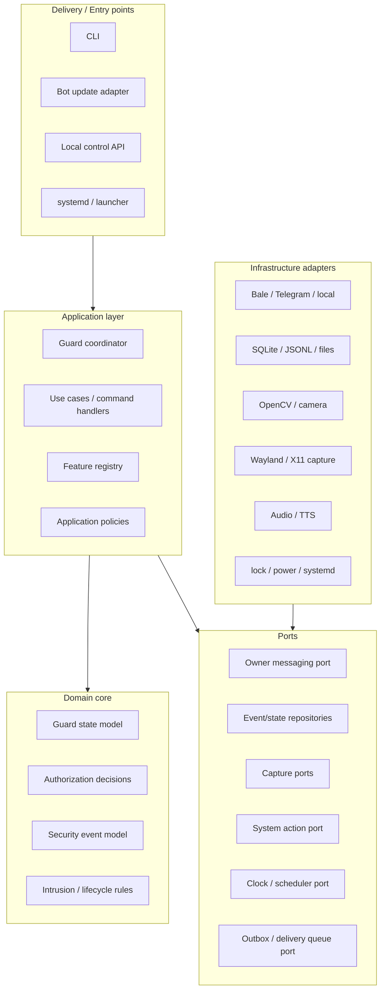

# Architecture

This document is the canonical architecture guide for Laptop Guard. It describes the current system, the desired dependency direction, and the target structure for future refactors. It is intentionally implementation-aware but does not require a rewrite.

For source-level findings and current limitations, see `SYSTEM_AUDIT.md`. For file ownership, see `FILE_REFERENCE.md`. For architecture decisions, see `adr/`.

## Architectural goal

Laptop Guard should remain a single-device, owner-controlled Linux security agent while becoming easier to change safely.

The target is a **modular monolith with ports and adapters**:

- one deployable/runtime process family;
- explicit feature registration;
- application/domain logic independent of HTTP libraries, desktop commands, hardware libraries, and persistence details;
- infrastructure hidden behind narrow ports;
- compatibility layers allowed temporarily, but not used as extension points for new work;
- no dynamic plugin loading or remote arbitrary execution.

This is not a microservice plan.

## Quality priorities

Architecture decisions follow this order:

1. security;
2. privacy;
3. correctness;
4. recoverability;
5. observability/testability;
6. simple user experience;
7. maintainability;
8. feature breadth.

## Current runtime

The current primary path is:

```text
run.sh
  -> python -m laptop_guard
  -> cli
  -> runtime configuration / pairing
  -> guard.LaptopGuard
       -> RuntimeApi
       -> FeatureManager
       -> GuardRuntimeState
       -> EventLog / EventStore
       -> input/camera/screen/audio/chat/TTS helpers
       -> warning/system-action helpers
       -> exit watchdog
```

The project already has several strong architectural seams:

- `RuntimeApi` is the outbound owner-transport port;
- `providers.build_provider() -> HttpBotProvider` is the single active Bale/Telegram transport construction path used by setup, Doctor, and runtime;
- `FeatureManager` is the explicit command/callback extension point;
- `FeatureHost` limits feature access to selected host capabilities;
- `GuardRuntimeState` / `RuntimeStateStore` provide shared persisted runtime state;
- `EventStore` provides SQLite events and a durable outbox primitive;
- system/media/hardware functions are mostly isolated in dedicated modules.

The largest remaining problem is that `LaptopGuard` still acts as composition root, application coordinator, security policy holder, transport loop, feature host, evidence orchestrator, media coordinator, and OS-action gateway at the same time.

## Target architecture



The important rule is not the folder names. The important rule is **dependency direction**: infrastructure can depend on application-defined interfaces; application/domain code must not depend on concrete HTTP, SQLite, OpenCV, shell commands, or desktop implementations.

## Layers and responsibilities

### Delivery / entry points

Examples: CLI commands, incoming bot updates/callbacks, optional local HTTP control, service/launcher events.

Responsibilities:

- parse external input;
- authenticate/identify the caller at the edge where appropriate;
- convert external payloads to typed application requests;
- call application use cases;
- format responses.

They should not own intrusion decisions, storage schema, hardware implementation, or system-action logic.

### Application layer

Responsibilities:

- orchestrate use cases;
- enforce application-level authorization and confirmation flow;
- coordinate ports;
- define transaction/lifecycle boundaries;
- convert domain outcomes to effects;
- own feature/use-case registration.

A future `GuardCoordinator` is a conceptual extraction target from `LaptopGuard`, not a required immediate file/class name.

### Domain core

The domain should contain logic that can be tested without a desktop, network, camera, microphone, or filesystem.

Candidate domain concepts:

- armed/disarmed/grace lifecycle;
- intrusion eligibility/cooldown decisions;
- confirmation state machines;
- event severity/category;
- bounded policy values;
- authorization decisions expressed as explicit results rather than side effects.

Not every existing dataclass needs to become a domain object. Extract domain logic only when it reduces coupling or enables clearer tests.

### Ports

Ports are narrow interfaces owned by the application/domain side.

Existing port:

- `RuntimeApi`.

Likely future ports where repeated coupling justifies them:

- `SystemActions` — lock/unlock/power/snapshot;
- `EvidenceCapture` — camera/screen/audio capture;
- `EventRepository` — durable security events;
- `NotificationOutbox` — reliable owner delivery;
- `Clock` / scheduler — testable time decisions;
- `WarningPresenter` — visual warning lifecycle.

Do **not** create ports for every function. Add a port when there are multiple adapters, security boundaries, expensive side effects, or important tests that benefit from substitution.

### Infrastructure adapters

Adapters implement ports using external technology:

- Bale/Telegram/local transport;
- Requests/httpx;
- SQLite/JSONL/files;
- OpenCV;
- ffmpeg/VLC/mpv/ffplay;
- Wayland/X11/GNOME tools;
- systemd/login/session commands.

Adapters may fail for environmental reasons. They should convert technology-specific failures into stable application errors/results.

## Composition root

There should be one obvious place where concrete adapters are selected and wired to application services.

Today this responsibility is spread across `LaptopGuard.__init__`, `build_runtime_api()`, CLI setup/runtime construction, and helper constructors.

Future refactors should move toward a dedicated composition step while keeping explicit registration. Avoid service locators, global mutable registries, or automatic filesystem discovery.

## Feature architecture

The explicit feature registry remains the preferred extension mechanism.

Rules:

- one feature owns each command/callback namespace;
- registration conflicts fail fast;
- features receive narrow capabilities/ports;
- features do not reach directly into concrete HTTP clients;
- features do not get arbitrary shell/filesystem capability;
- long-lived feature resources implement deterministic `start()` / `stop()`;
- common cross-feature behavior belongs in application services, not copied host methods.

As more features are extracted, `FeatureHost` should not grow into a large service locator. If a feature needs several capabilities, inject a small feature-specific context/protocol.

## State ownership

State should be categorized explicitly:

| Category | Owner | Examples |
|---|---|---|
| Configuration | config subsystem | provider, thresholds, opt-ins |
| Durable runtime control state | runtime-state repository | armed, grace, arm-ready |
| Volatile process state | application coordinator | current offset, worker handles, in-flight confirmation |
| Security event history | event repository | intrusion/lock/failed-login events |
| Delivery state | outbox | pending owner notifications/media |
| Evidence files | evidence/media store | screenshots, camera images, recordings |

Avoid storing the same authoritative value in multiple places. When duplication is needed for caching, document the source of truth and refresh rules.

## Persistence architecture

Current persistence is intentionally mixed: config/secrets files, runtime-state JSON, fail-safe JSONL events, SQLite events/outbox, and media files.

The target is not necessarily one database. The target is **clear ownership and lifecycle**:

- config/secrets remain user-scoped and permission-restricted;
- runtime control state has one authoritative repository;
- security event durability remains independent from transport availability;
- outgoing notifications use the outbox when reliability matters;
- evidence/media receives explicit retention/quota policy;
- migrations are idempotent and tested.

## Messaging and delivery

Owner notification should conceptually separate:

1. creation of an application event/message;
2. durable enqueue when required;
3. provider delivery;
4. retry/backoff/terminal failure handling.

This prevents network availability from becoming part of intrusion-response correctness.

Urgent local security actions such as warning/lock must never wait on remote delivery.

## Concurrency model

Laptop Guard currently uses threads and subprocesses. Future architecture should make ownership explicit rather than introducing another concurrency framework by default.

Rules:

- each long-lived worker has one owner;
- startup/shutdown order is deterministic;
- cancellation uses explicit events/tokens;
- shared state changes go through defined state boundaries;
- callbacks from hardware/provider threads should quickly hand work to application logic;
- blocking network/hardware work must not delay warning/lock safety actions;
- retries, queues, recordings, and worker counts stay bounded.

Do not migrate to asyncio merely for style. Adopt a different concurrency model only when there is a measured coordination problem and a staged migration plan.

## Error model

Expected environmental failures should become structured, actionable outcomes rather than raw tracebacks.

Error categories worth keeping distinct:

- configuration/validation;
- authorization/denial;
- unavailable capability/hardware;
- provider/network/transient;
- persistence/corruption;
- OS action failure;
- invariant/programming error.

Do not broadly swallow programming errors in core application logic. Adapters may catch technology-specific exceptions and translate them.

## Security boundaries

Hard boundaries:

- owner identity and confirmation gates remain centralized and explicit;
- no arbitrary remote shell, generic script execution, or unrestricted filesystem control;
- no hidden capture or privacy-indicator suppression;
- secret material never flows through ordinary logs/events/prompts;
- local APIs are authenticated and loopback-only by default;
- remote/provider data is untrusted input;
- callback numeric/text payloads are bounded before use;
- OS actions receive fixed/validated arguments;
- local security response must remain functional when remote services fail.

Security review is required when moving a responsibility across boundaries, because a refactor can accidentally move authorization after a side effect.

## Compatibility layers

Compatibility code is acceptable when it enables incremental migration, but it must have an explicit status:

- active path;
- compatibility path;
- deprecated path;
- removal candidate.

New features must use the active path. Compatibility facades should not gain new behavior except fixes required for safe migration/removal.

For owner transport, `laptop_guard/bale_api.py` is compatibility-only.
`HttpBotProvider` plus provider profiles is the active implementation for both
Bale and Telegram. See `PROVIDERS.md`.

Current consolidation targets identified by the system audit:

- warning compatibility layers;
- multiple system-action facades;
- older/secondary audio abstractions.

## Dependency rules

See `architecture/BOUNDARIES.md` for the detailed matrix. In summary:

- domain must not import infrastructure;
- application may import domain and port definitions;
- adapters implement ports and may import third-party/native libraries;
- delivery calls application use cases rather than manipulating repositories/hardware directly;
- features depend on application ports/capabilities, not concrete adapters;
- composition code is allowed to know all layers because it wires them.

## Evolution strategy

See `architecture/EVOLUTION_PLAN.md`.

The architecture should evolve through behavior-preserving slices:

1. document and measure boundaries;
2. extract application orchestration from the monolithic guard in small flows;
3. consolidate duplicate adapters/facades;
4. make durable delivery and retention first-class;
5. enforce boundaries with lightweight tests/tooling;
6. remove compatibility paths only after callers/tests/docs migrate.

No phase requires a flag-day rewrite.

## Architecture review checklist

Before approving a non-trivial design, ask:

- Which layer owns this behavior?
- Is there already a port/service for it?
- Does the dependency direction point inward?
- Is authorization checked before side effects?
- What happens without network/hardware/desktop access?
- Which state is authoritative?
- Is the side effect bounded and cancellable?
- Does this introduce another implementation of an existing responsibility?
- Can the core decision be tested without infrastructure?
- What migration/rollback path exists?
- Which compatibility path becomes easier to remove afterward?

If a proposal cannot answer these, it needs more architecture work before implementation.
