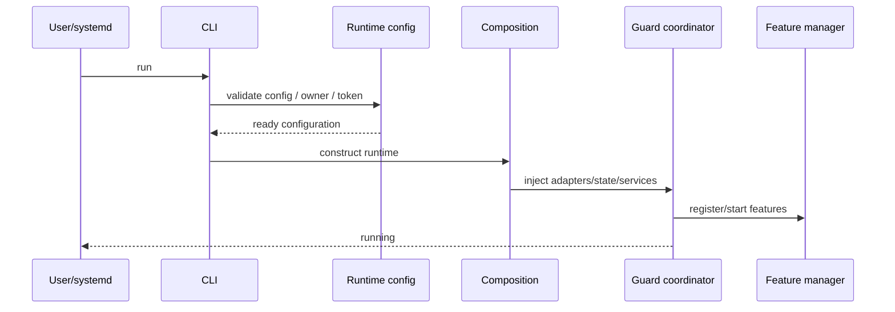
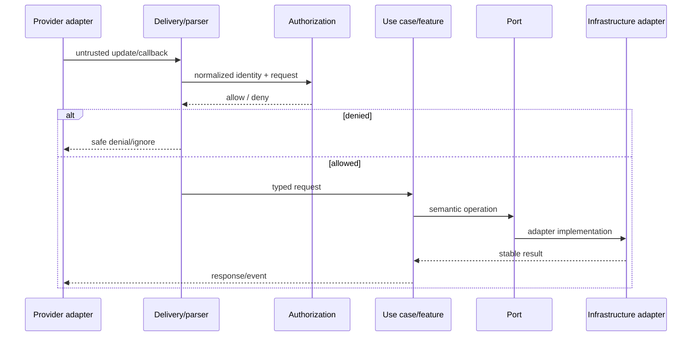
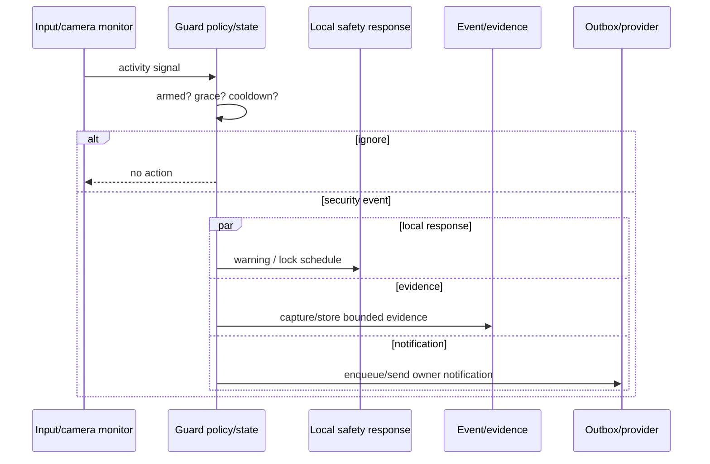
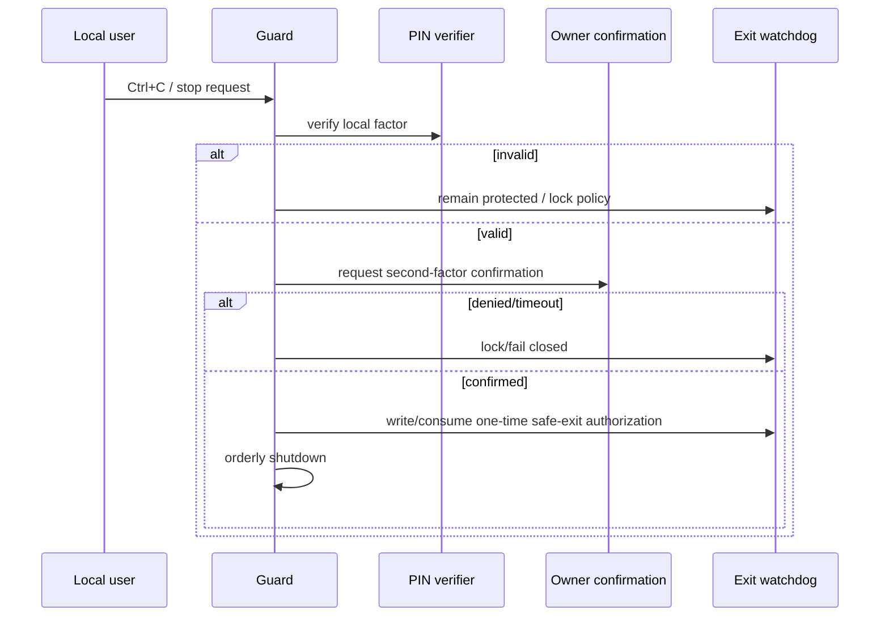
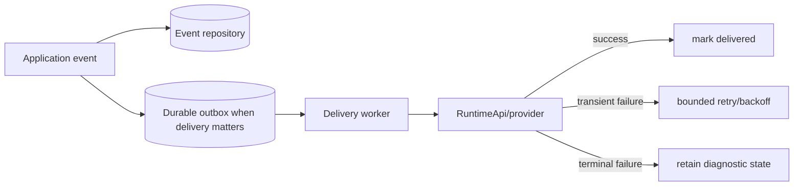

# Runtime and security flows

These diagrams make control flow and security ordering explicit. They describe the current conceptual flow and the preferred target boundaries; exact function names may evolve.

## Startup



Architecture requirement: configuration validation happens before remote/security-sensitive runtime actions; construction is explicit; feature startup has deterministic ownership.

## Incoming owner command



Authorization must occur before privileged side effects. Parsing/bounds checking must occur before values reach application logic.

## Intrusion/input alert



Critical property: local warning/lock correctness must not depend on network delivery or evidence upload latency.

## Protected stop



The authorization decision must remain ahead of shutdown side effects. Refactors must preserve fail-closed behavior.

## Event and owner delivery

Preferred target:



Remote failure must not erase the local security event. Retrying must be bounded and observable.

## Evidence lifecycle

Preferred target:

```text
capture request
  -> capability check
  -> bounded capture
  -> local evidence metadata/event
  -> optional owner delivery reference
  -> retention/quota evaluation
  -> delete only by explicit safe policy
```

Evidence storage and remote delivery are related but separate responsibilities.

## Configuration change while running

```text
CLI/config writer
  -> atomic persistent update
  -> runtime state/config boundary
  -> running process refreshes only explicitly live fields
```

Not every configuration value should become live-reloadable. Live fields must be documented; others should require restart to avoid partial runtime reconfiguration.

## Failure ordering principles

When multiple effects happen during a security event, prioritize:

1. preserve local safety response;
2. persist the event;
3. capture bounded evidence when permitted/available;
4. notify owner;
5. enrich/secondary UI behavior.

A lower-priority failure must not cancel a higher-priority safety action.
